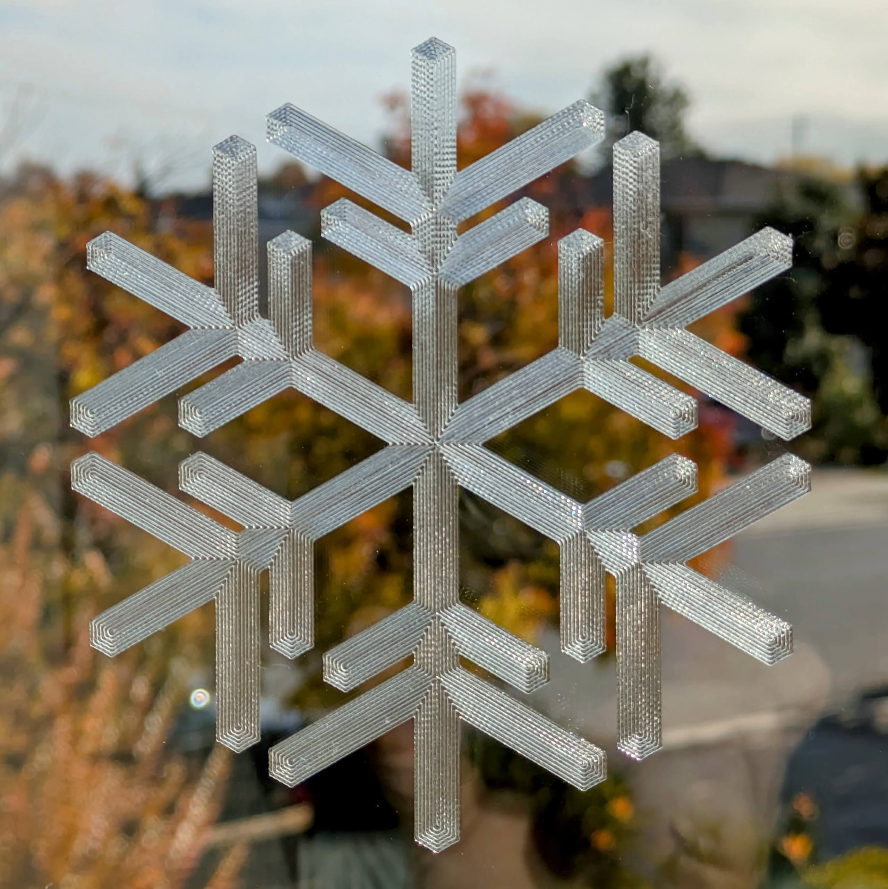
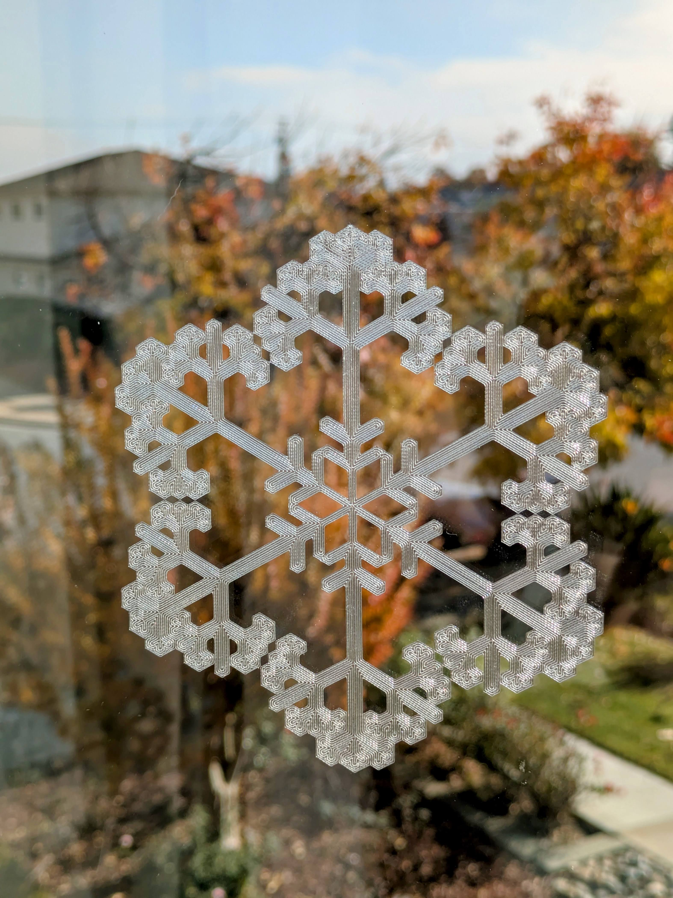
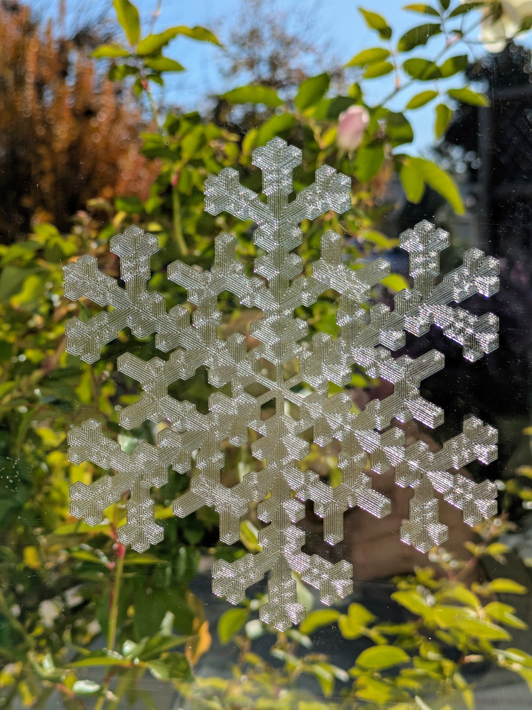
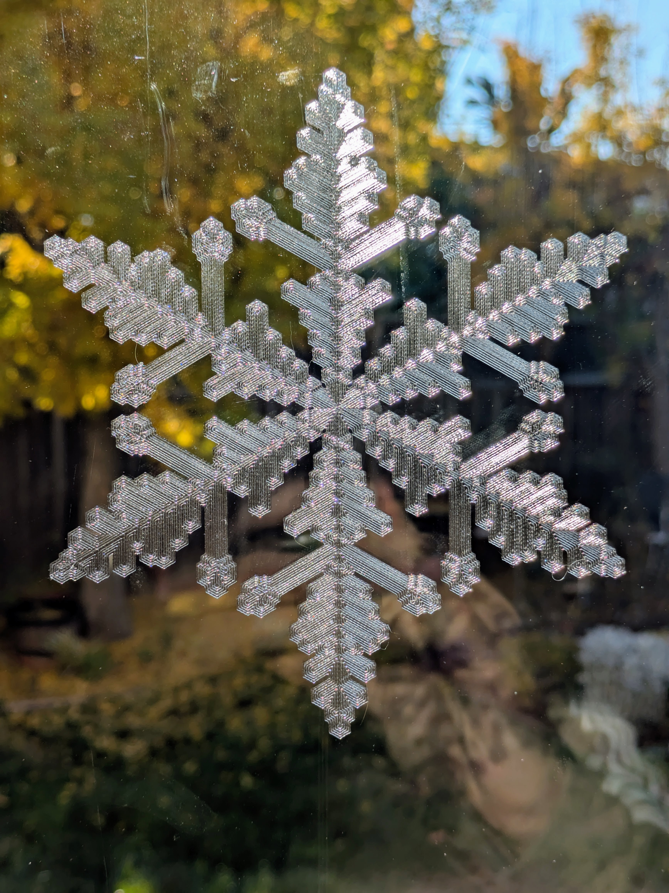
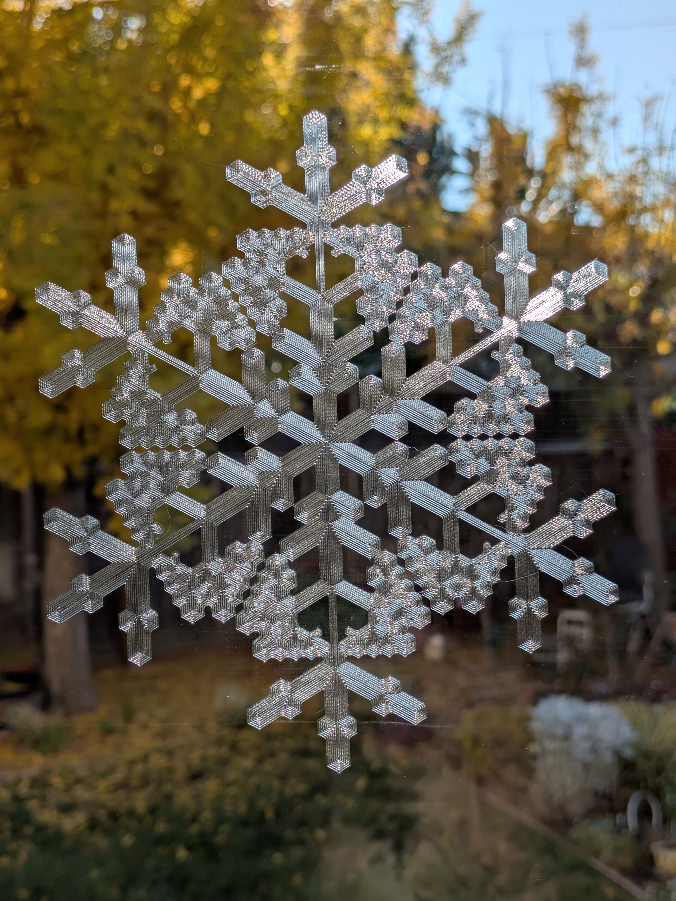
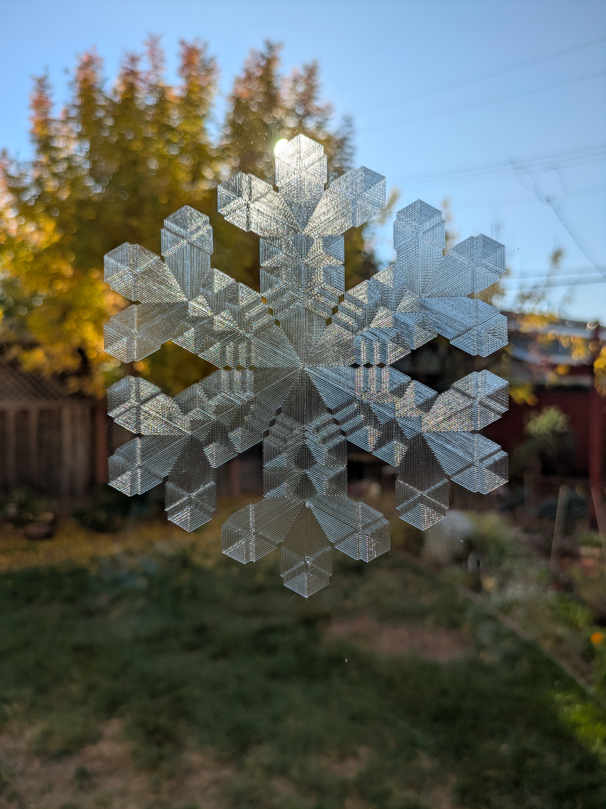
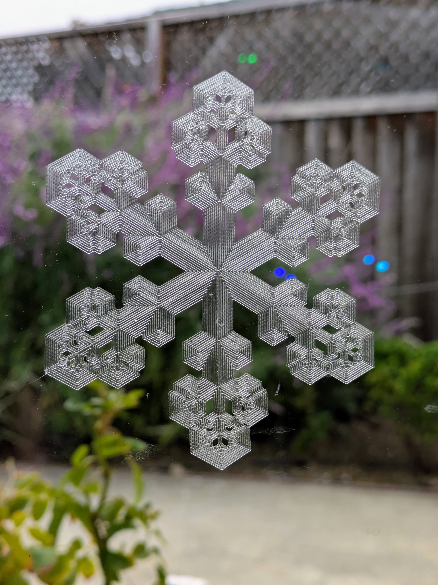
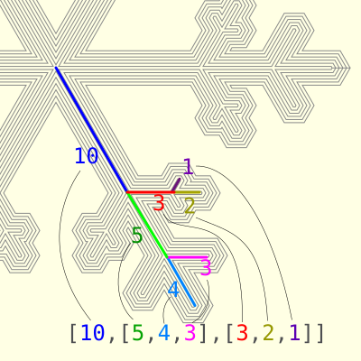

# neĝero

SnowFlake G-code generator

For printing on 3D printer with transparent material PETG, Polycarbonate, etc. In a single layer.

Generate set of continious outline paths expanding from center with branches under 30 degrees.

## Examples

```js
npx neghero -j "{tree:[4,[3,[10,[8,[2,1,1],[3,1,1]],[5,5,[3,2,[2,1,1]]]],3],3],s:8,l:7,p:2.8}" -o neghero-0004.gcode
```

```js
npx neghero -c examples/neghero-0005.json5 -o neghero-0005.gcode
```

<div>









</div>

## CLI usage

`npx neghero`

```txt
Usage: neghero [options]

Options:
  -c, --config <file>   config file (JSON5)
  -j, --json <string>   config string (JSON5)
  -p, --profile <file>  printer / material profile file (JSON5)
  -o, --output <file>   output G-code file
  -h, --help            display help for command
```

## SnowFlake configuration format

Each unique snoflake is defined by object with following properties:

### tree:

A structure, defining topology of snowflake arms.
It is a recursive structure of nodes, where node is a 3 element array:

#### Node

```
[trunk, center, side]
```

* trunk - natural number defining length of trunk line.
* center - element defining center branch. Could be:
  - natural number, for a final central branch.
  - Node, for a next level of the tree.
* side - element defining two side branches. Could be:
  - natural number, for a final side branches.
  - Node, for a next level of the tree.



### s:

Tree scale. natural number to scale tree numbers. (optional, default: 4)

### l:

Layer count. natural number defining number of layers lines around the skeleton of the tree. (optional, default: 4)

### p:

display/print grid pitch. (optional, default: 2)

## Online version

https://observablehq.com/@drom/neghero

## Other

View G-code online: https://ncviewer.com

## TODO

Online version: neghero.drom.io

Printer / material related parameters:

* line spacing
* line width
* layer height
* print speed
